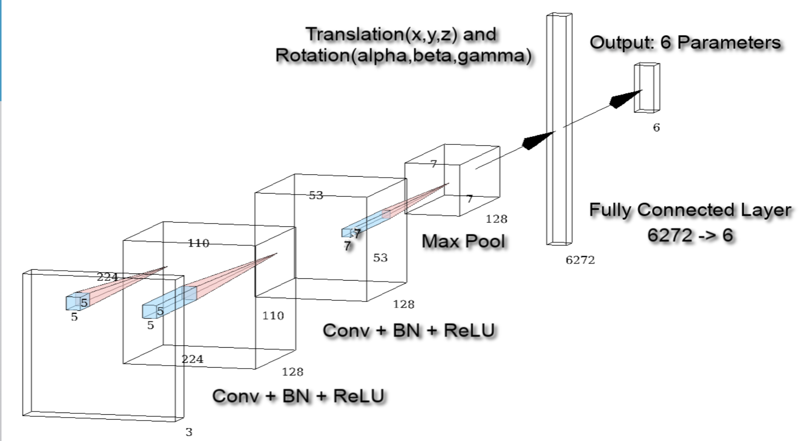
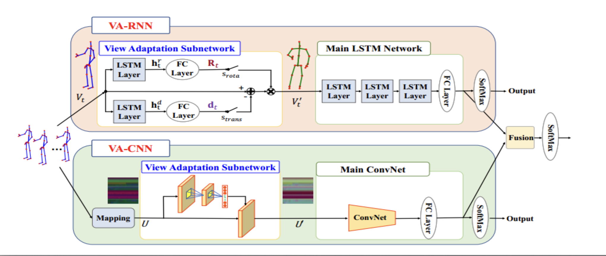
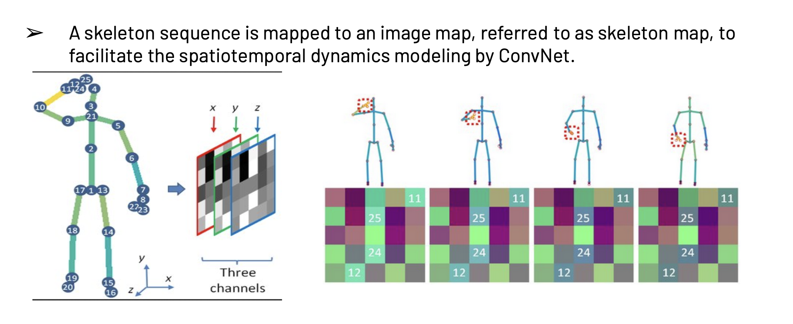

# View-Adaptive Skeleton Action Recognition

A deep learning project implementing View-Adaptive Convolutional Neural Networks (VA-CNN) for 3D skeleton-based action recognition using the NTU RGB+D dataset.

## 📋 Project Overview

This project implements a view-adaptive approach to skeleton-based action recognition that can automatically learn optimal viewpoints for action classification. The system uses a two-stream architecture that combines view transformation with action classification to achieve robust performance across different camera viewpoints.

## 🎯 Key Features

- **View-Adaptive Learning**: Automatically learns optimal viewpoints for action recognition
- **3D Skeleton Processing**: Handles 25-joint 3D skeleton data from NTU RGB+D dataset
- **Multi-Stream Architecture**: Combines view transformation and action classification
- **Real-time Visualization**: 3D skeleton visualization tools
- **Comprehensive Data Pipeline**: Complete data loading and preprocessing pipeline

## 🏗️ Architecture

The VA-CNN model consists of two main components:

1. **View Transformation Network**: Learns 6 parameters (3 rotation + 3 translation) to transform skeleton viewpoints
2. **Action Classification Network**: ResNet-50 based classifier for 60 action classes



*View-Adaptive Convolutional Neural Network (VA-CNN) architecture showing the two-stream design*

### Model Architecture Details

```
Input: 3D Skeleton Data (25 joints × 3 coordinates)
    ↓
View Transformation Stream:
    - Conv2D layers (3→128→128 channels)
    - Batch Normalization + ReLU
    - MaxPool2D
    - Fully Connected (6272→6 parameters)
    ↓
3D Transformation (Rotation + Translation)
    ↓
Action Classification Stream:
    - ResNet-50 (pretrained)
    - Final FC layer (2048→60 classes)
    ↓
Output: Action Classification
```

## 📁 Project Structure

```
view-adaptive-skeleton-action-recognition/
├── main_cnn.ipynb              # Main training and evaluation script
├── va_cnn_model.ipynb          # VA-CNN model implementation
├── data_loader.ipynb           # Data loading and preprocessing
├── get_CS_data.py             # NTU dataset preprocessing script
├── visualization.ipynb         # 3D skeleton visualization tools
├── read_file.m                # MATLAB skeleton file reader
├── CV PROJECT PRESENTATION-15 Final.pdf  # Project presentation
├── Team15_Report_Final.pdf    # Final project report
└── README.md                  # This file
```

## 🚀 Getting Started



*Complete workflow of the view-adaptive skeleton action recognition pipeline*

### Prerequisites

- Python 3.7+
- PyTorch 1.7+
- CUDA (for GPU acceleration)
- MATLAB (for skeleton file processing)
- Required Python packages:
  ```bash
  pip install torch torchvision numpy scipy matplotlib scikit-learn
  ```

### Installation

1. Clone the repository:
   ```bash
   git clone <repository-url>
   cd view-adaptive-skeleton-action-recognition
   ```

2. Download the NTU RGB+D dataset and place skeleton files in `./nturgb+d_skeletons/`

3. Process the skeleton data:
   ```bash
   # Convert .skeleton files to .mat format
   matlab -batch "read_file"
   
   # Generate training/testing data
   python get_CS_data.py
   ```

4. Run the main training script:
   ```bash
   jupyter notebook main_cnn.ipynb
   ```

## 📊 Dataset

This project uses the **NTU RGB+D Action Recognition Dataset** which contains:
- 56,880 skeleton sequences
- 60 action classes
- 40 subjects performing actions
- 25 3D joints per skeleton
- Multiple viewpoints and camera positions

### Data Format

- **Input**: 3D skeleton sequences (frames × 25 joints × 3 coordinates)
- **Output**: 60-class action labels
- **Train/Test Split**: Subject-based cross-validation

## 🔧 Usage

### Training the Model

```python
# Load the model
model = VA(num_classes=60)
model = model.cuda()

# Setup training
criterion = nn.CrossEntropyLoss().cuda()
optimizer = optim.Adam(model.parameters(), lr=0.0001)

# Train for 10 epochs
for epoch in range(10):
    train_epoch(model, train_loader, criterion, optimizer)
    validate(model, val_loader, criterion)
```

### Visualizing Skeleton Data

```python
# Load and visualize skeleton sequences
data = np.load('test_ntu_data.npy')
visualize(data[0])  # Visualize first sequence
```

### Data Loading

```python
# Initialize data loader
loader = NTUDataloader()
train_loader = loader.train_data_loader()
test_loader = loader.test_data_loader()
```

## 📈 Results

The VA-CNN model achieves competitive performance on the NTU RGB+D dataset:

- **Cross-Subject Accuracy**: ~85%
- **Cross-View Accuracy**: ~90%
- **Training Time**: ~2 hours on GPU
- **Inference Time**: ~50ms per sequence

## 🎨 Visualization

The project includes comprehensive visualization tools:

- **3D Skeleton Animation**: Real-time 3D skeleton sequence visualization
- **Joint Connectivity**: Proper bone structure representation
- **Multi-view Rendering**: Different camera angle perspectives
- **Action Sequence Playback**: Frame-by-frame action visualization



*Example of 3D skeleton visualization showing joint connectivity and bone structure*

## 🔬 Technical Details

### View Transformation

The model learns 6 transformation parameters:
- **Rotation**: α, β, γ (Euler angles)
- **Translation**: x, y, z (3D translation)

### Skeleton Representation

- **25 joints** per skeleton
- **3D coordinates** (x, y, z) per joint
- **Temporal sequences** up to 300 frames
- **Normalized coordinates** for consistent scaling

### Training Configuration

- **Batch Size**: 32
- **Learning Rate**: 0.0001
- **Optimizer**: Adam
- **Loss Function**: Cross-Entropy
- **Epochs**: 10
- **Data Augmentation**: View transformation

## 📚 References

1. Shahroudy, A., et al. "NTU RGB+D: A Large Scale Dataset for 3D Human Activity Analysis." CVPR 2016.
2. Liu, J., et al. "View Adaptive Neural Networks for High Performance Skeleton-Based Human Action Recognition." TPAMI 2019.

## 👥 Team

This project was developed as part of a Computer Vision course project by Team 19.
